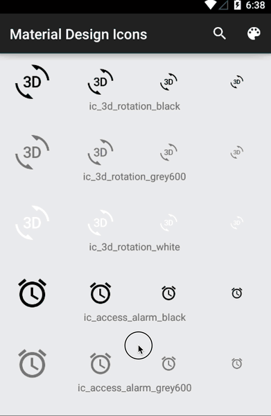

Matrial Design Icon Pack
========================

An Android friendly way of adding [Matrial Design Icons](https://github.com/google/material-design-icons) to your Android application

NOTE: This aar is quite bit (~46M) which can inflate your final APK by as much. Since the Android Gradle build system can strip unused resources, I highly suggest you enable it in your project. You might even consider running it for debug builds (which sadly makes your builds slower :(). Read about it more [here](http://tools.android.com/tech-docs/new-build-system/resource-shrinking).

```groovy
android {
    ...

    buildTypes {
        release {
            minifyEnabled true
            shrinkResources true
        }
    }
    ...
}
```

Snapshot
========

You can try it now via Maven Central snapshots.

Gradle:
```groovy
repositories {
    maven { url "https://oss.sonatype.org/content/repositories/snapshots/" }
}

dependencies {
    compile 'ca.vijaysharma:material-design-icons:1.0.0-SNAPSHOT@aar'
}
```

Stable Release
==============

Coming soon...


Building
========
```
# git clone git@github.com:vijaysharm/material-design-icons.git
# cd material-design-icons
# ./scripts/get-icons.sh
# ./gradlew assembleDebug
```

Uploading to Maven
==================
Assumes you have the following properties set someplace

```
NEXUS_USERNAME=...
NEXUS_PASSWORD=...

signing.keyId=...
signing.password=...
signing.secretKeyRingFile=...
```

```
# ./gradlew uploadArchives
```

Sample App
==========
Wading through the icons can be a pain. You can build and install the sample app to see a list of all the icons. You can search for specific icons, and you can change the background color to match with your theme to see which one will work best.


